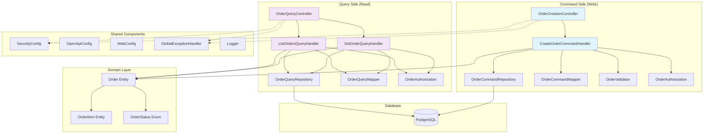
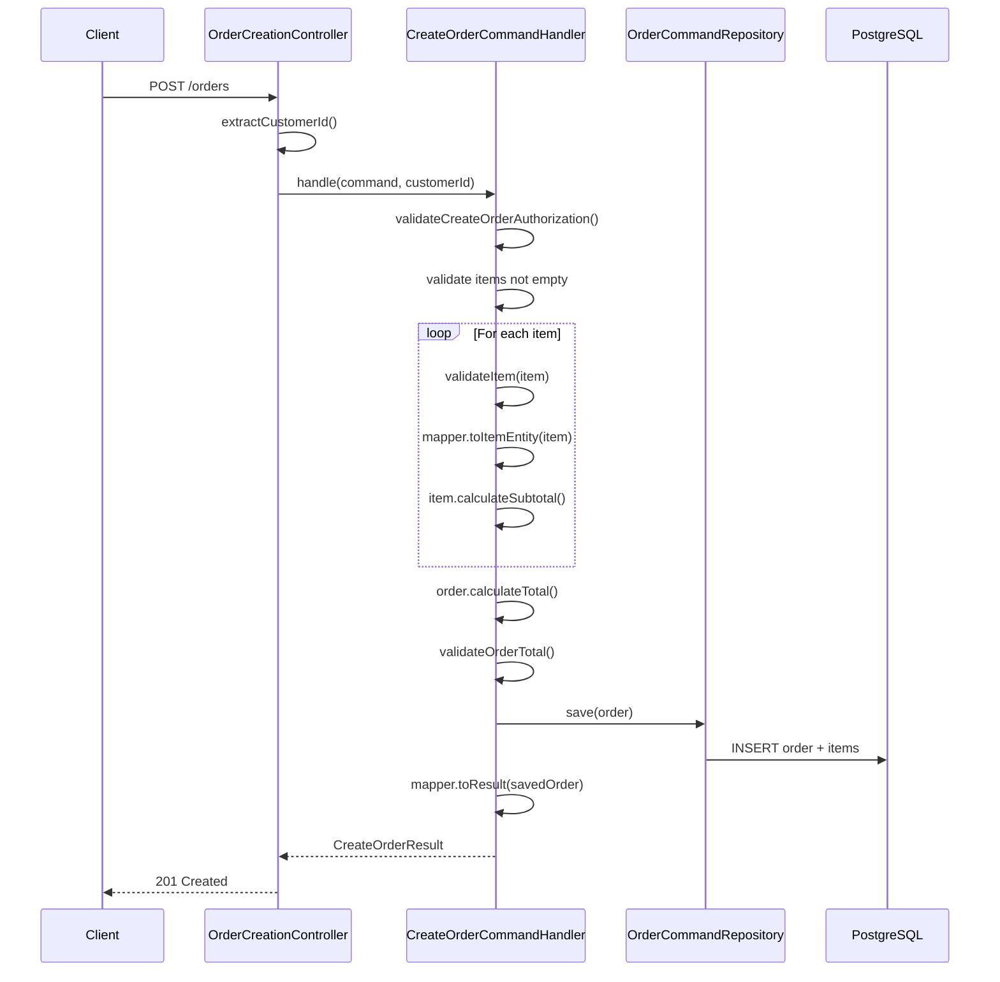
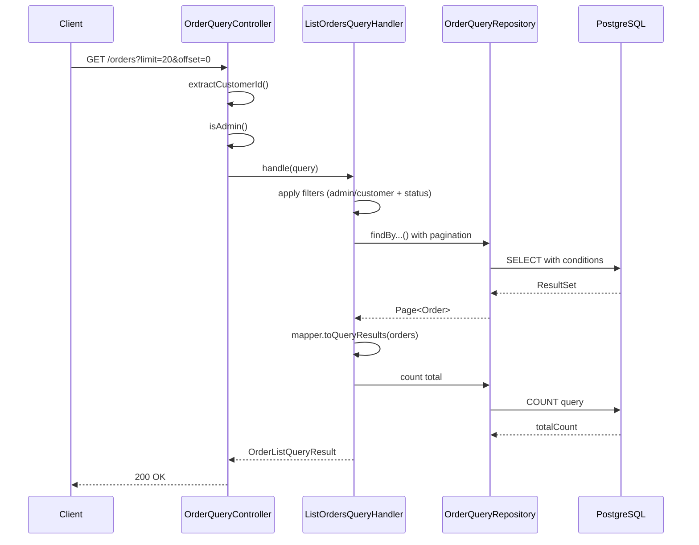
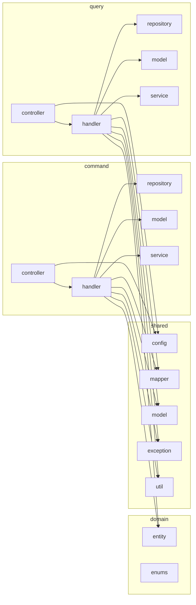
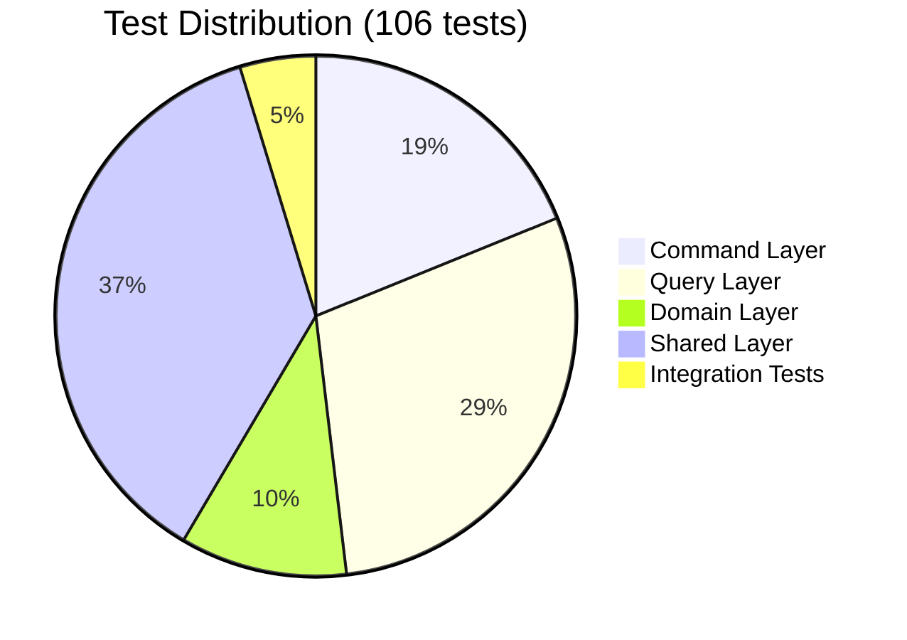
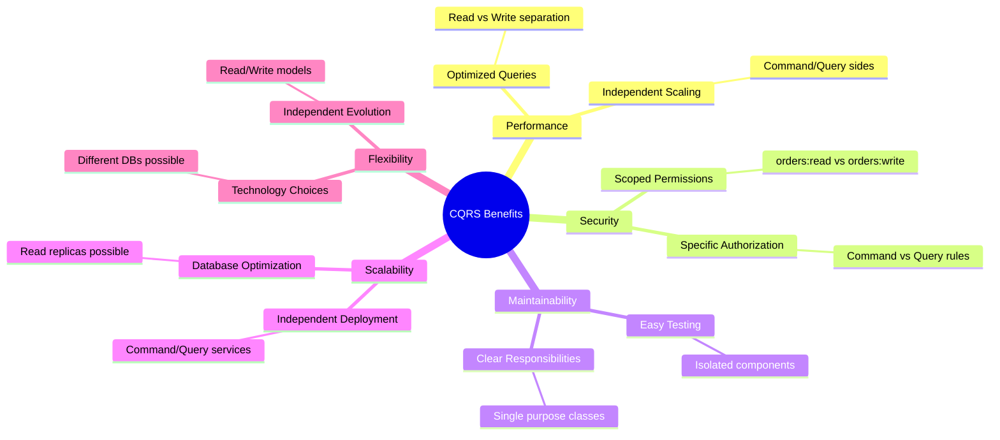

# Orders Service - Java Spring Boot REST API

Este é um **serviço REST completo** para gerenciamento de pedidos em Java com **Spring Boot** seguindo **SDD (Spec-Driven Development)**.

## 🎯 Visão Geral

Serviço de pedidos enterprise-grade implementando **CQRS (Command Query Responsibility Segregation)** com OpenAPI 3.1.0 specification:

- ✅ **CQRS Architecture**: Separação clara entre comandos (write) e queries (read)
- ✅ **Design-First**: OpenAPI 3.1.0 spec como fonte única de verdade (SSOT)
- ✅ **3 Operações Core**: createOrder, listOrders, getOrder
- ✅ **Arquitetura em Camadas**: Controllers → Handlers → Repositories
- ✅ **Spring Boot 4.x**: Framework enterprise de última geração
- ✅ **Java 25**: Recursos modernos e performance de ponta
- ✅ **JUnit 6**: Framework de testes mais recente
- ✅ **JWT Security**: Autenticação com scopes (orders:read, orders:write)
- ✅ **PostgreSQL**: Banco de dados relacional enterprise
- ✅ **Flyway**: Migrações de banco versionadas
- ✅ **Paginação**: Suporte a limit/offset
- ✅ **Audit Logging**: Rastreamento de operações para compliance
- ✅ **Test Coverage**: 99% instruções + 95% branches (Jacoco)

---

## 📁 Estrutura do Projeto

```
poc-sdd-example/
├── src/main/java/com/company/orders/
│   ├── OrdersApplication.java              # Aplicação Spring Boot principal
│   ├── command/                            # 🆕 Write Operations (CQRS)
│   │   ├── controller/
│   │   │   └── OrderCreationController.java    # POST /orders
│   │   ├── handler/
│   │   │   └── CreateOrderCommandHandler.java  # Lógica de criação
│   │   ├── repository/
│   │   │   └── OrderCommandRepository.java     # Write operations
│   │   ├── service/
│   │   │   └── OrderAuthorization.java         # Autorização de comandos
│   │   ├── model/
│   │   │   ├── CreateOrderCommand.java         # Command DTO
│   │   │   └── CreateOrderResult.java          # Result DTO
│   │   └── repository/
│   │       └── OrderCommandRepository.java     # Write repository
│   ├── query/                             # 🆕 Read Operations (CQRS)
│   │   ├── controller/
│   │   │   └── OrderQueryController.java       # GET /orders, GET /orders/{id}
│   │   ├── handler/
│   │   │   ├── GetOrderQueryHandler.java       # Handler para buscar pedido
│   │   │   └── ListOrdersQueryHandler.java     # Handler para listar pedidos
│   │   ├── repository/
│   │   │   └── OrderQueryRepository.java       # Read operations
│   │   ├── service/
│   │   │   └── OrderAuthorization.java         # Autorização de queries
│   │   ├── model/
│   │   │   ├── GetOrderQuery.java              # Query DTO
│   │   │   ├── ListOrdersQuery.java            # Query DTO
│   │   │   ├── OrderQueryResult.java           # Result DTO
│   │   │   └── OrderListQueryResult.java       # Paginated result
│   │   └── repository/
│   │       └── OrderQueryRepository.java       # Read repository
│   ├── domain/                            # 🆕 Domain Entities
│   │   ├── entity/
│   │   │   ├── Order.java                      # Entidade JPA
│   │   │   ├── OrderItem.java                  # Item entity
│   │   │   └── AuditLog.java                   # Audit trail
│   │   └── enums/
│   │       └── OrderStatus.java                # Status enum
│   ├── shared/                            # 🆕 Shared Components
│   │   ├── config/
│   │   │   ├── SecurityConfig.java             # Spring Security + JWT
│   │   │   ├── OpenApiConfig.java              # Configuração OpenAPI
│   │   │   └── WebConfig.java                  # CORS
│   │   ├── mapper/
│   │   │   ├── OrderCommandMapper.java         # Command mappers
│   │   │   └── OrderQueryMapper.java           # Query mappers
│   │   ├── model/
│   │   │   ├── OrderItemDto.java               # Shared DTO
│   │   │   └── ErrorResponse.java              # Error DTO
│   │   ├── exception/
│   │   │   ├── OrderException.java             # Exceções customizadas
│   │   │   ├── ResourceNotFoundException.java  # 404
│   │   │   ├── AuthorizationException.java     # 403
│   │   │   └── GlobalExceptionHandler.java     # @ControllerAdvice
│   │   ├── util/
│   │       └── Logger.java                     # Logging estruturado
│   │   └── service/
│       └── OrderValidator.java                 # Validação compartilhada
│
├── src/test/java/com/company/orders/
│   ├── command/
│   │   ├── controller/
│   │   │   └── OrderCreationControllerTest.java    # 🆕 Testes unitários
│   │   └── handler/
│   │       └── CreateOrderCommandHandlerTest.java  # Testes unitários
│   ├── query/
│   │   ├── controller/
│   │   │   └── OrderQueryControllerTest.java       # 🆕 Testes unitários
│   │   └── handler/
│   │       ├── GetOrderQueryHandlerTest.java       # 🆕 Testes unitários
│   │       └── ListOrdersQueryHandlerTest.java     # 🆕 Testes unitários
│   ├── domain/entity/
│   │   └── OrderTest.java                      # Testes de entidade
│   ├── shared/
│   │   ├── exception/
│   │   │   ├── ExceptionsTest.java             # Testes de exceções
│   │   │   └── GlobalExceptionHandlerTest.java # Testes de handler
│   │   ├── service/
│   │   │   └── OrderValidatorTest.java         # Testes de validação
│   │   └── util/
│       └── LoggerTest.java                     # Testes de utilitários
│   ├── integration/
│       └── OrderIntegrationTest.java           # Testes de integração
│
├── src/main/resources/
│   ├── application.yml                     # Configuração principal
│   ├── application-test.yml                # Configuração de testes
│   ├── db/migration/
│   │   └── V1__orders_schema.sql           # Schema inicial
│   └── openapi-spec.yaml                   # OpenAPI 3.1.0 spec
│
├── pom.xml                                 # Dependências Maven
├── docker-compose.yml                      # PostgreSQL + app
└── README.md                               # Este arquivo
```

---

## 🚀 Como Usar

### Pré-requisitos

- **Java 25** instalado
- **Maven 3.9+** instalado
- **Docker** e **Docker Compose** (para PostgreSQL)

### 1. Clonar Repositório

```bash
git clone <repository-url>
cd poc-sdd-example
```

### 2. Rodar PostgreSQL com Docker

```bash
docker-compose up -d postgres
```

### 3. Rodar Aplicação

```bash
# Compilar e rodar
mvn spring-boot:run

# Ou compilar e rodar JAR
mvn clean package
java -jar target/domain-service-1.0.0-SNAPSHOT.jar
```

### 4. Acessar Aplicação

- **API Base**: http://localhost:8080
- **Swagger UI**: http://localhost:8080/swagger-ui.html
- **OpenAPI Docs**: http://localhost:8080/v3/api-docs
- **Health Check**: http://localhost:8080/actuator/health

---

## 📊 API Endpoints

### 1. Criar Pedido (POST /orders)

```bash
curl -X POST http://localhost:8080/orders \
  -H "Content-Type: application/json" \
  -H "Authorization: Bearer <JWT_TOKEN>" \
  -d '{
    "customerId": "550e8400-e29b-41d4-a716-446655440000",
    "items": [
      {
        "productId": "p123",
        "quantity": 2,
        "pricePerUnit": 99.99
      },
      {
        "productId": "p456",
        "quantity": 1,
        "pricePerUnit": 49.99
      }
    ]
  }'
```

**Resposta (201 Created):**
```json
{
  "id": "ord-550e8400-e29b-41d4-a716-446655440000",
  "customerId": "550e8400-e29b-41d4-a716-446655440000",
  "status": "pending",
  "total": 249.97,
  "items": [
    {
      "productId": "p123",
      "quantity": 2,
      "pricePerUnit": 99.99,
      "subtotal": 199.98
    },
    {
      "productId": "p456",
      "quantity": 1,
      "pricePerUnit": 49.99,
      "subtotal": 49.99
    }
  ],
  "createdAt": "2026-02-25T10:30:00Z"
}
```

### 2. Listar Pedidos (GET /orders)

```bash
curl -X GET "http://localhost:8080/orders?limit=20&offset=0&status=pending" \
  -H "Authorization: Bearer <JWT_TOKEN>"
```

**Resposta (200 OK):**
```json
{
  "data": [
    {
      "id": "ord-1",
      "customerId": "550e8400-e29b-41d4-a716-446655440000",
      "status": "pending",
      "total": 249.97,
      "items": [],
      "createdAt": "2026-02-25T10:30:00Z"
    }
  ],
  "totalCount": 42,
  "limit": 20,
  "offset": 0
}
```

### 3. Obter Pedido por ID (GET /orders/{orderId})

```bash
curl -X GET http://localhost:8080/orders/550e8400-e29b-41d4-a716-446655440000 \
  -H "Authorization: Bearer <JWT_TOKEN>"
```

**Resposta (200 OK):**
```json
{
  "id": "ord-550e8400-e29b-41d4-a716-446655440000",
  "customerId": "550e8400-e29b-41d4-a716-446655440000",
  "status": "confirmed",
  "total": 249.97,
  "items": [
    {
      "productId": "p123",
      "quantity": 2,
      "pricePerUnit": 99.99,
      "subtotal": 199.98
    }
  ],
  "createdAt": "2026-02-25T10:30:00Z"
}
```

---

## 🧪 Executar Testes

```bash
# Todos os testes
mvn test

# Apenas testes unitários
mvn test -Dtest='!*IntegrationTest'

# Apenas testes de integração
mvn test -Dtest='*IntegrationTest'

# Com cobertura detalhada
mvn clean verify

# Gerar relatório de cobertura apenas
mvn jacoco:report
```

### 📊 Cobertura de Testes

| Métrica | Valor | Meta | Status |
|---------|-------|------|--------|
| **Instruções** | 99% | 95% | ✅ **Ultrapassada** |
| **Branches** | 95% | 90% | ✅ **Ultrapassada** |
| **Testes Totais** | 106 | - | ✅ **Completos** |

### 🧪 Suite de Testes

#### Testes Unitários (101 testes)
- **Command Layer** (20 testes):
  - `OrderCreationControllerTest` - 9 testes (branches de autenticação/autorização)
  - `CreateOrderCommandHandlerTest` - 6 testes (lógica de negócio + validações)

- **Query Layer** (31 testes):
  - `OrderQueryControllerTest` - 11 testes (branches de autenticação/autorização)
  - `GetOrderQueryHandlerTest` - 4 testes (busca + autorização)
  - `ListOrdersQueryHandlerTest` - 8 testes (paginação + filtros + autorização)

- **Domain Layer** (11 testes):
  - `OrderTest` - 11 testes (entidade e cálculos)

- **Shared Layer** (39 testes):
  - `OrderValidatorTest` - 12 testes (validações de negócio)
  - `OrderAuthorizationTest` - 7 testes (regras de acesso)
  - `ExceptionsTest` - 6 testes (exceções customizadas)
  - `GlobalExceptionHandlerTest` - 6 testes (tratamento de erros)
  - `LoggerTest` - 8 testes (logging estruturado)

#### Testes de Integração (3 testes)
- `OrderIntegrationTest` - 3 testes (fluxos completos end-to-end)

### 🎯 Branches Cobertos

#### Controllers (85%+ cobertura)
- **OrderQueryController**: `extractCustomerId()`, `isAdmin()` - todos os branches
- **OrderCreationController**: `extractCustomerId()` - todos os branches

#### Handlers (100% cobertura)
- **CreateOrderCommandHandler**: Lógica de criação, validações, autorizações
- **GetOrderQueryHandler**: Busca, autorização, tratamento de erros
- **ListOrdersQueryHandler**: Paginação, filtros, admin vs customer

#### Services (100% cobertura)
- **OrderValidator**: Validações de itens, totais, regras de negócio
- **OrderAuthorization**: Regras de acesso, permissões

---

## 🗄️ Banco de Dados

### Schema

O serviço utiliza 3 tabelas principais:

#### 1. **orders** - Pedidos principais
```sql
CREATE TABLE orders (
  id UUID PRIMARY KEY,
  customer_id UUID NOT NULL,
  status VARCHAR(20) CHECK (status IN ('pending', 'confirmed', 'shipped', 'delivered')),
  total NUMERIC(10, 2) NOT NULL,
  created_at TIMESTAMP WITH TIME ZONE NOT NULL,
  updated_at TIMESTAMP WITH TIME ZONE NOT NULL
);
```

#### 2. **order_items** - Itens do pedido
```sql
CREATE TABLE order_items (
  id UUID PRIMARY KEY,
  order_id UUID NOT NULL REFERENCES orders(id) ON DELETE CASCADE,
  product_id VARCHAR(255) NOT NULL,
  quantity INTEGER NOT NULL CHECK (quantity > 0),
  price_per_unit NUMERIC(10, 2) NOT NULL,
  subtotal NUMERIC(10, 2) NOT NULL,
  created_at TIMESTAMP WITH TIME ZONE NOT NULL
);
```

#### 3. **audit_logs** - Auditoria
```sql
CREATE TABLE audit_logs (
  id UUID PRIMARY KEY,
  entity_type VARCHAR(50) NOT NULL,
  entity_id UUID NOT NULL,
  operation VARCHAR(20) NOT NULL,
  customer_id UUID,
  details JSONB,
  created_at TIMESTAMP WITH TIME ZONE NOT NULL
);
```

---

## 🔐 Segurança

### JWT Authentication

O serviço espera JWT tokens no header `Authorization`:

```
Authorization: Bearer <token>
```

### Payload JWT Esperado

```json
{
  "customerId": "550e8400-e29b-41d4-a716-446655440000",
  "scopes": ["orders:read", "orders:write"],
  "iat": 1703084400,
  "exp": 1703170800
}
```

### Escopos

- **orders:read** - Ler pedidos
- **orders:write** - Criar pedidos
- **admin** - Permissões administrativas (ver todos os pedidos)

### Regras de Autorização

- **Usuários comuns**: Veem apenas seus próprios pedidos
- **Admins**: Veem todos os pedidos
- **customerId** é extraído do JWT token automaticamente

---

## 📊 Stack Tecnológico

| Aspecto | Tecnologia | Versão | Justificativa |
|---------|-----------|--------|---------------|
| **Framework** | Spring Boot | 4.x | Framework enterprise de última geração |
| **Linguagem** | Java | 25 | Recursos modernos, performance de ponta |
| **Persistência** | JPA/Hibernate | 6.x | ORM padrão, gerenciamento de relacionamentos |
| **Banco de Dados** | PostgreSQL | 16 | Relacional enterprise-grade |
| **Segurança** | Spring Security + JWT | 6.x | Built-in, OAuth2 ready |
| **Migrações** | Flyway | 10.x | Versionamento de schema |
| **Mapeamento** | MapStruct | 1.6 | Type-safe, compile-time |
| **Testes** | JUnit 6 + Mockito | 6.x / 5.x | Framework de testes mais recente |
| **API Docs** | Springdoc OpenAPI | 2.6 | Auto-geração de documentação |
| **Logging** | SLF4J + Logback | 2.x | Structured logging |

---

## 🏗️ Arquitetura

### CQRS Overview

```mermaid
graph TD
    A[HTTP Request] --> B{Operation Type}

    B -->|POST /orders| C[Command Side]
    C --> C1[OrderCreationController]
    C1 --> C2[CreateOrderCommandHandler]
    C2 --> C3[OrderCommandRepository]
    C3 --> C4[(PostgreSQL Write)]

    B -->|GET /orders| D[Query Side]
    B -->|GET /orders/{id}| D

    D --> D1[OrderQueryController]
    D1 --> D2{Query Type}
    D2 -->|Get Order| D3[GetOrderQueryHandler]
    D2 -->|List Orders| D4[ListOrdersQueryHandler]
    D3 --> D5[OrderQueryRepository]
    D4 --> D5
    D5 --> D6[(PostgreSQL Read)]
```

### CQRS Architecture Diagram



### CQRS Flow Diagrams

#### Command Flow (Create Order)



#### Query Flow (List Orders)



### Package Structure



### Test Coverage Overview



### CQRS Benefits Achieved



---

## 🔄 Regras de Negócio

### Criação de Pedidos

1. ✅ Pedido deve ter pelo menos 1 item
2. ✅ Quantidade de cada item deve ser >= 1
3. ✅ Preço unitário deve ser > 0
4. ✅ Total é calculado automaticamente (soma dos subtotais)
5. ✅ Subtotal de cada item = quantidade × preço unitário
6. ✅ Status inicial é sempre "pending"
7. ✅ customerId deve corresponder ao usuário autenticado

### Listagem de Pedidos

1. ✅ Usuários veem apenas seus próprios pedidos
2. ✅ Admins veem todos os pedidos
3. ✅ Resultados ordenados por createdAt DESC (mais novo primeiro)
4. ✅ Paginação: limit máximo de 100, padrão 20
5. ✅ Filtro opcional por status

### Consulta de Pedido

1. ✅ Usuário só pode ver seus próprios pedidos
2. ✅ Admin pode ver qualquer pedido
3. ✅ Retorna 404 se pedido não existe
4. ✅ Retorna 403 se usuário não tem permissão

---

## 🐳 Docker

### Rodar apenas PostgreSQL

```bash
docker-compose up -d postgres
```

### Rodar aplicação completa

```bash
docker-compose up --build
```

### Parar serviços

```bash
docker-compose down
```

### Limpar volumes

```bash
docker-compose down -v
```

---

## 📝 Tratamento de Erros

### Códigos de Erro Estruturados

```json
{
  "code": "VALIDATION_ERROR",
  "message": "Invalid input data",
  "path": "/orders",
  "timestamp": "2026-02-25T10:30:00Z",
  "traceId": "550e8400-e29b-41d4-a716-446655440000",
  "details": [
    "items: Items cannot be empty"
  ]
}
```

### Códigos Disponíveis

- **VALIDATION_ERROR** (400) - Entrada inválida
- **AUTHENTICATION_ERROR** (401) - Sem JWT válido
- **AUTHORIZATION_ERROR** (403) - Sem permissão
- **NOT_FOUND** (404) - Recurso não existe
- **RATE_LIMIT_EXCEEDED** (429) - Rate limit
- **INTERNAL_ERROR** (500) - Erro do servidor

---

## 🔍 Audit Logging

O serviço inclui tabela `audit_logs` para rastreamento de operações:

- **Compliance**: GDPR, SOX, etc.
- **Debugging**: Rastrear mudanças
- **Security**: Detectar acessos suspeitos

**Nota**: Implementação de audit logging é opcional para MVP.

---

## 📚 Próximos Passos

### MVP Atual (v1.0.0)
- ✅ 3 operações: create, get, list
- ✅ JWT authentication
- ✅ Paginação
- ✅ Audit logging (schema)

### Roadmap Futuro

#### v2.0
- [ ] Webhooks para eventos
- [ ] Refunds
- [ ] Payment integration
- [ ] Update order status endpoint
- [ ] Delete order endpoint

#### v3.0
- [ ] AsyncAPI para eventos
- [ ] GraphQL optional
- [ ] Real-time updates (WebSockets)
- [ ] Advanced analytics

---

## 🤝 Contribuindo

1. Fork o projeto
2. Crie uma branch (`git checkout -b feature/improvement`)
3. Commit suas mudanças (`git commit -am 'Add improvement'`)
4. Push para a branch (`git push origin feature/improvement`)
5. Abra um Pull Request

---

## 📄 Licença

Apache 2.0 - veja LICENSE para detalhes.

---

**Versão**: 1.1.0  
**Última Atualização**: 2026-03-01  
**Stack**: Java 25 + Spring Boot 4 + JUnit 6 + CQRS  
**OpenAPI**: 3.1.0  
**Cobertura**: 99% instruções + 95% branches  
**Arquitetura**: CQRS (Command Query Responsibility Segregation)  
**Autor**: SDD Documentation Team
