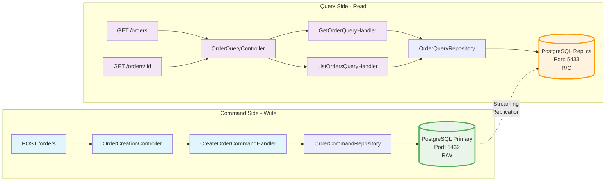

# Orders Service

[]()
[]()
[]()
[]()
[]()
[]()
[]()
[]()
[]()
[]()

Serviço REST enterprise-grade para gerenciamento de pedidos com **CQRS** e **Read Replicas PostgreSQL**.

---

## 🎯 Features

- ✅ **CQRS Architecture** - Separação física de databases (Command/Query)
- ✅ **PostgreSQL Replication** - Primary (R/W) + Replica (R/O) com streaming replication
- ✅ **JWT Authentication** - Autenticação segura com scopes (orders:read, orders:write, admin)
- ✅ **High Test Coverage** - 99% instruções + 95% branches (106 testes)
- ✅ **OpenAPI 3.1.0** - Documentação automática com Swagger UI
- ✅ **Spring Boot 4** - Framework enterprise de última geração
- ✅ **Java 25** - Recursos modernos e performance de ponta
- ✅ **Docker Ready** - Containerização completa com Docker Compose

---

## ⚡ Quick Start

### Pré-requisitos

- Java 25
- Maven 3.9+
- Docker & Docker Compose

### Executar

```bash
# 1. Iniciar PostgreSQL Primary e Replica
docker-compose up -d postgres-primary postgres-replica

# 2. Rodar aplicação
mvn spring-boot:run

# 3. Acessar Swagger UI
open http://localhost:8080/swagger-ui.html
```

**Pronto!** A API está rodando em `http://localhost:8080`

---

## 📊 Stack Tecnológico

| Tecnologia | Versão | Uso |
|------------|--------|-----|
| **Java** | 25 | Linguagem |
| **Spring Boot** | 4.0 | Framework |
| **PostgreSQL** | 16 | Database (Primary + Replica) |
| **JUnit** | 6 | Testes |
| **Docker** | Latest | Containers |
| **Flyway** | 10.x | Migrações de schema |

---

## 🏗️ Arquitetura

### CQRS Overview com Read Replicas



**Command Side** → PostgreSQL Primary (R/W)  
**Query Side** → PostgreSQL Replica (R/O)  
**Replicação** → Streaming assíncrona (lag < 1s)

---

## 🔌 Exemplo de Uso

### Criar Pedido

```bash
curl -X POST http://localhost:8080/orders \
  -H "Content-Type: application/json" \
  -H "Authorization: Bearer <JWT_TOKEN>" \
  -d '{
    "customerId": "550e8400-e29b-41d4-a716-446655440000",
    "items": [
      {
        "productId": "p123",
        "quantity": 2,
        "pricePerUnit": 99.99
      }
    ]
  }'
```

**Resposta (201 Created):**
```json
{
  "id": "ord-550e8400-e29b-41d4-a716-446655440000",
  "customerId": "550e8400-e29b-41d4-a716-446655440000",
  "status": "pending",
  "total": 199.98,
  "items": [...],
  "createdAt": "2026-03-01T10:30:00Z"
}
```

Ver [API.md](docs/API.md) para mais exemplos e todos os endpoints.

---

## 📚 Documentação

### Guias Completos

- 🏗️ **[Arquitetura](docs/ARCHITECTURE.md)** - CQRS, diagramas Mermaid, package structure, benefícios
- 🔌 **[API](docs/API.md)** - Endpoints, autenticação, exemplos curl, tratamento de erros
- 💻 **[Desenvolvimento](docs/DEVELOPMENT.md)** - Setup local, testes, cobertura, troubleshooting
- 🗄️ **[Banco de Dados](docs/DATABASE.md)** - Schema, migrações, replicação, backup/restore
- 🔐 **[Segurança](docs/SECURITY.md)** - JWT, scopes, regras de autorização, audit logging
- 🚀 **[Deploy](docs/DEPLOYMENT.md)** - Docker Compose, monitoramento, health checks
- 🗺️ **[Roadmap](docs/ROADMAP.md)** - Versões futuras (v2.1, v3.0)
- 📖 **[CQRS Read Replicas](docs/CQRS-READ-REPLICAS.md)** - Guia técnico completo

### Links Rápidos

- **Swagger UI**: http://localhost:8080/swagger-ui.html
- **OpenAPI Docs**: http://localhost:8080/v3/api-docs
- **Health Check**: http://localhost:8080/actuator/health

---

## 🧪 Testes

```bash
# Executar todos os testes
mvn test

# Gerar relatório de cobertura
mvn clean verify

# Ver relatório
open target/site/jacoco/index.html
```

### Cobertura Atual

| Métrica | Valor | Meta | Status |
|---------|-------|------|--------|
| **Instruções** | 99% | 95% | ✅ Ultrapassada |
| **Branches** | 95% | 90% | ✅ Ultrapassada |
| **Testes Totais** | 106 | - | ✅ Completos |

**Distribuição:**
- Command Layer: 20 testes
- Query Layer: 31 testes
- Domain Layer: 11 testes
- Shared Layer: 39 testes
- Integration: 5 testes

### Stress Tests (JMeter)

```bash
# Executar stress test (5 minutos)
./jmeter/scripts/run-test.sh

# Ver documentação completa
cat jmeter/README-JMETER.md
```

**Cenários:**
- Warm-up: 10 usuários (1 min)
- Load Test: 50 usuários (2 min)
- Stress Test: 100 usuários (2 min)

Ver [jmeter/README-JMETER.md](jmeter/README-JMETER.md) para detalhes.

---

## 🐳 Docker

### Iniciar Infraestrutura Completa

```bash
# Iniciar Primary, Replica e App
docker-compose up --build

# Apenas databases
docker-compose up -d postgres-primary postgres-replica

# Parar tudo
docker-compose down
```

### Verificar Replicação

```bash
# Status da replicação
docker exec -it orders-db-primary psql -U postgres -c "SELECT * FROM pg_stat_replication;"

# Lag de replicação
docker exec -it orders-db-replica psql -U postgres -c "SELECT now() - pg_last_xact_replay_timestamp() AS replication_lag;"
```

Ver [DEPLOYMENT.md](docs/DEPLOYMENT.md) para comandos completos e troubleshooting.

---

## 🤝 Contribuindo

1. Fork o projeto
2. Crie uma branch (`git checkout -b feature/nova-feature`)
3. Commit suas mudanças (`git commit -m 'feat: adicionar nova feature'`)
4. Push para a branch (`git push origin feature/nova-feature`)
5. Abra um Pull Request

### Conventional Commits

Use o formato:
- `feat(scope): descrição` - Nova feature
- `fix(scope): descrição` - Bug fix
- `docs(scope): descrição` - Documentação
- `refactor(scope): descrição` - Refatoração

### Validação Mermaid

Antes de commitar diagramas Mermaid:

```bash
# Validar diagramas
python3 validate-mermaid.py

# Testar online
open https://mermaid.live/
```

---

## 📄 Licença

Apache 2.0 - veja [LICENSE](LICENSE) para detalhes.

---

**Versão**: 2.0.0  
**Última Atualização**: 2026-03-01  
**Stack**: Java 25 + Spring Boot 4 + PostgreSQL 16 + CQRS  
**Cobertura**: 99% instruções + 95% branches  
**Arquitetura**: CQRS com Read Replicas (Command Query Responsibility Segregation)  
**Database**: PostgreSQL Primary (5432) + Replica (5433) com Streaming Replication  
**Autor**: SDD Documentation Team

---

**🚀 Pronto para produção!** Ver [DEPLOYMENT.md](docs/DEPLOYMENT.md) para instruções de deploy.
