# Arquitetura - Orders Service

Este documento detalha a arquitetura CQRS (Command Query Responsibility Segregation) com Read Replicas do Orders Service.

## 📋 Índice

- [CQRS Overview](#cqrs-overview-com-read-replicas)
- [CQRS Architecture Diagram](#cqrs-architecture-diagram)
- [CQRS Flow Diagrams](#cqrs-flow-diagrams)
- [Package Structure](#package-structure)
- [Test Coverage](#test-coverage-overview)
- [CQRS Benefits](#cqrs-benefits-achieved)

---

## CQRS Overview com Read Replicas

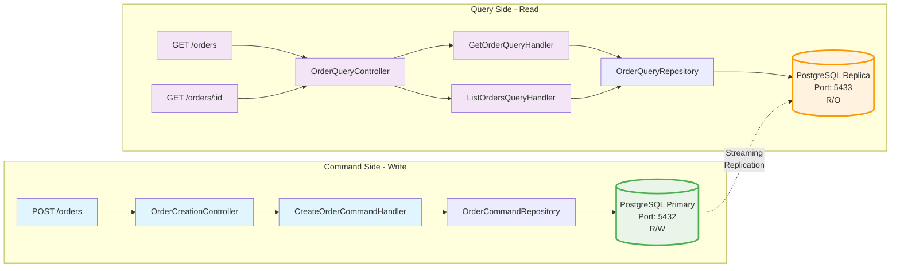

### Arquitetura CQRS com Separação Física de Bases

#### 1. Command Side (Write Operations)

- `POST /orders` → `OrderCreationController` → `CreateOrderCommandHandler` → `OrderCommandRepository`
- Conecta ao **PostgreSQL Primary** (porta 5432) com acesso Read/Write
- Transaction Manager: `commandTransactionManager`

#### 2. Query Side (Read Operations)

- `GET /orders` → `OrderQueryController` → `GetOrderQueryHandler` → `OrderQueryRepository`
- `GET /orders/{id}` → `OrderQueryController` → `ListOrdersQueryHandler` → `OrderQueryRepository`
- Conecta ao **PostgreSQL Replica** (porta 5433) com acesso Read-Only
- Transaction Manager: `queryTransactionManager`

#### 3. Replicação

- Streaming Replication assíncrona do Primary para Replica
- Eventual Consistency (delay típico < 1s)
- Réplica pode ser promovida a Primary em caso de failover

#### 4. Benefícios

- ✅ **Performance**: Queries não impactam writes
- ✅ **Escalabilidade**: Adicionar réplicas conforme demanda
- ✅ **Disponibilidade**: Failover automático
- ✅ **Segurança**: Query side read-only

📚 **Documentação Técnica Completa**: Ver [CQRS-READ-REPLICAS.md](CQRS-READ-REPLICAS.md)

---

## CQRS Architecture Diagram

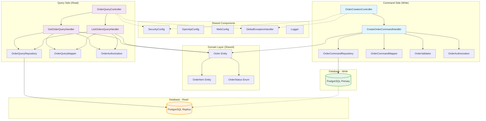

### Camadas da Arquitetura

#### Domain Layer (Shared)
- **Order Entity**: Entidade principal de pedido
- **OrderItem Entity**: Itens do pedido
- **OrderStatus Enum**: Estados do pedido (pending, confirmed, shipped, delivered)

#### Shared Components
- **SecurityConfig**: Configuração Spring Security + JWT
- **OpenApiConfig**: Configuração OpenAPI/Swagger
- **WebConfig**: Configuração CORS e Web
- **GlobalExceptionHandler**: Tratamento global de exceções
- **Logger**: Logging estruturado

#### Command Side (Write)
- **OrderCreationController**: REST controller para criação
- **CreateOrderCommandHandler**: Lógica de negócio de criação
- **OrderCommandRepository**: Repositório de escrita
- **OrderCommandMapper**: Mapeamento de DTOs
- **OrderValidator**: Validações de negócio
- **OrderAuthorization**: Regras de autorização

#### Query Side (Read)
- **OrderQueryController**: REST controller para consultas
- **GetOrderQueryHandler**: Handler para buscar pedido específico
- **ListOrdersQueryHandler**: Handler para listar pedidos
- **OrderQueryRepository**: Repositório de leitura
- **OrderQueryMapper**: Mapeamento de DTOs
- **OrderAuthorization**: Regras de autorização

---

## CQRS Flow Diagrams

### Command Flow (Create Order)

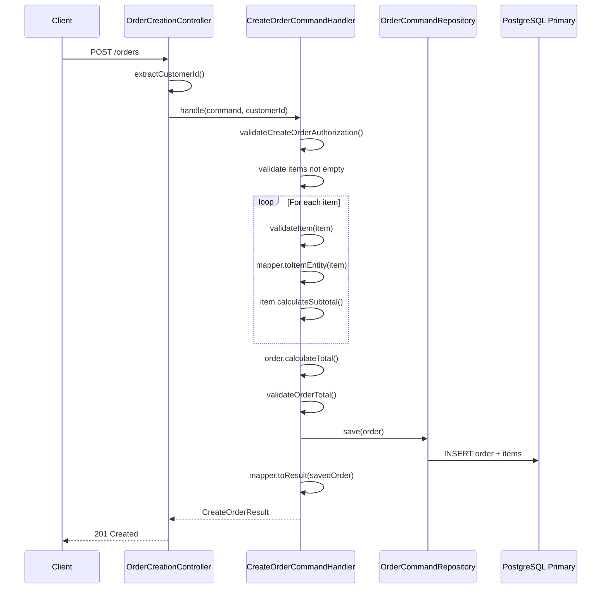

#### Fluxo de Criação de Pedido

1. **Cliente** envia `POST /orders` com dados do pedido
2. **Controller** extrai `customerId` do JWT token
3. **Handler** valida autorização (usuário pode criar pedido?)
4. **Handler** valida que há pelo menos 1 item
5. **Loop** para cada item:
   - Valida item (quantidade > 0, preço > 0)
   - Mapeia DTO para entidade
   - Calcula subtotal
6. **Handler** calcula total do pedido
7. **Handler** valida total (não pode ser zero)
8. **Repository** salva pedido no **PostgreSQL Primary**
9. **Handler** mapeia entidade para DTO de resultado
10. **Controller** retorna `201 Created`

---

### Query Flow (List Orders)

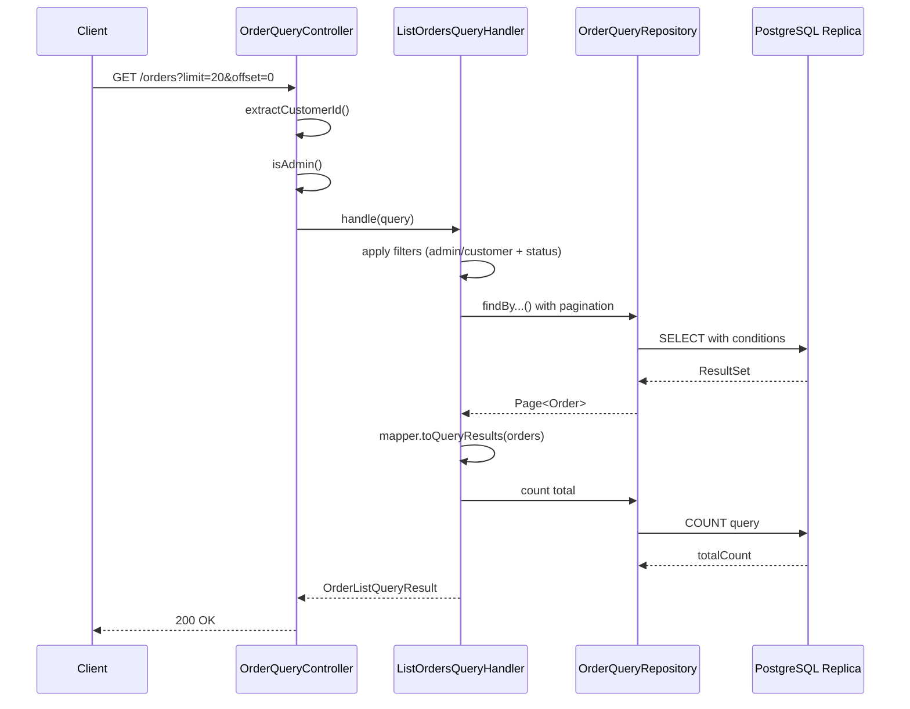

#### Fluxo de Listagem de Pedidos

1. **Cliente** envia `GET /orders` com parâmetros de paginação
2. **Controller** extrai `customerId` do JWT token
3. **Controller** verifica se usuário é admin
4. **Handler** aplica filtros:
   - Admin: vê todos os pedidos
   - Usuário comum: vê apenas seus pedidos
   - Filtro opcional por status
5. **Repository** executa query paginada no **PostgreSQL Replica**
6. **Handler** mapeia entidades para DTOs
7. **Repository** executa COUNT para total de registros
8. **Controller** retorna `200 OK` com dados paginados

---

## Package Structure

### Macro View - High Level Packages

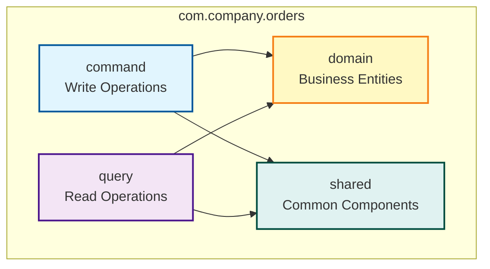

### Command Side - Detailed Structure

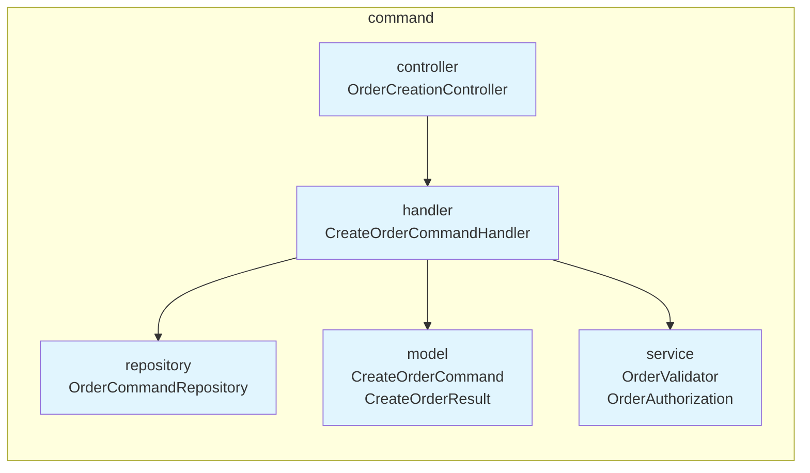

**Componentes:**
- **controller**: REST endpoints para comandos
- **handler**: Lógica de negócio de comandos
- **repository**: Acesso ao PostgreSQL Primary
- **model**: DTOs de comando e resultado
- **service**: Validações e autorizações

### Query Side - Detailed Structure

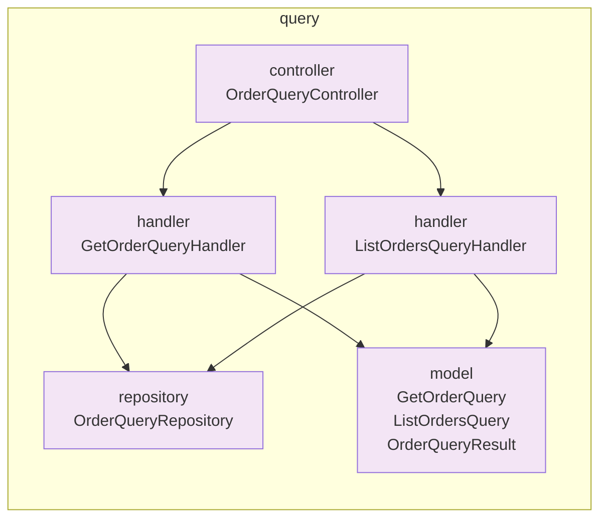

**Componentes:**
- **controller**: REST endpoints para queries
- **handler**: Lógica de negócio de queries
- **repository**: Acesso ao PostgreSQL Replica
- **model**: DTOs de query e resultado

### Domain Layer - Detailed Structure

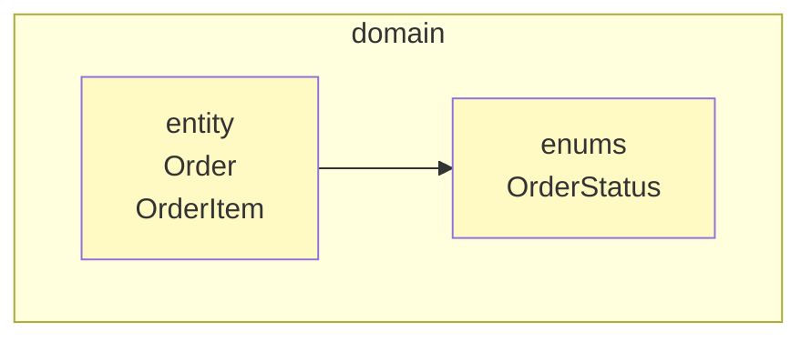

**Componentes:**
- **entity**: Entidades JPA (Order, OrderItem)
- **enums**: Enumerações (OrderStatus)

### Shared Components - Detailed Structure

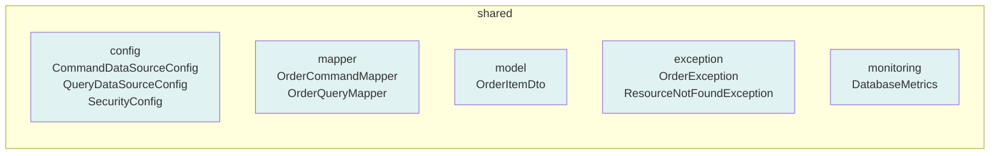

**Componentes:**
- **config**: Configurações (DataSources, Security, OpenAPI)
- **mapper**: MapStruct mappers (Command, Query)
- **model**: DTOs compartilhados
- **exception**: Exceções customizadas e handlers
- **monitoring**: Métricas de replicação e health checks

---

## Test Coverage Overview

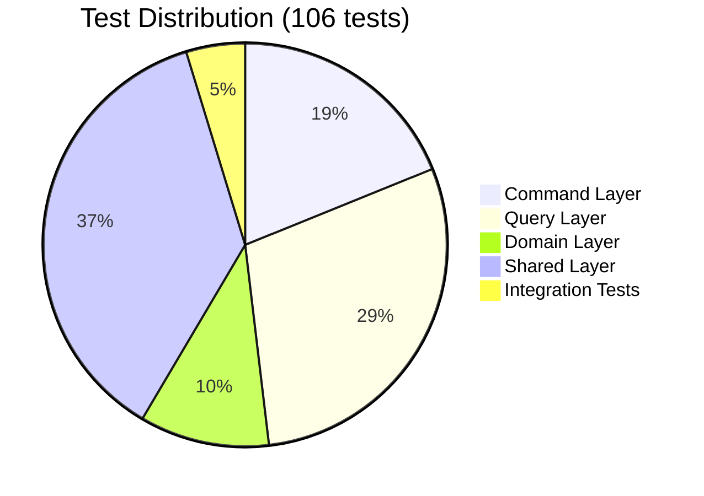

### Distribuição de Testes

- **Command Layer** (20 testes): Controllers e handlers de escrita
- **Query Layer** (31 testes): Controllers e handlers de leitura
- **Domain Layer** (11 testes): Entidades e lógica de domínio
- **Shared Layer** (39 testes): Validações, autorizações, exceções
- **Integration Tests** (5 testes): Testes end-to-end

**Cobertura Total**: 99% instruções + 95% branches

Ver [DEVELOPMENT.md](DEVELOPMENT.md) para detalhes completos de testes.

---

## CQRS Benefits Achieved

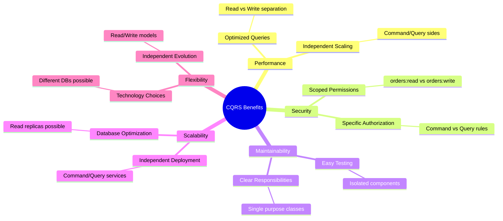

### Benefícios Alcançados

#### Performance
- **Optimized Queries**: Separação entre leitura e escrita permite otimizações específicas
- **Independent Scaling**: Command e Query podem escalar independentemente

#### Security
- **Specific Authorization**: Regras diferentes para comandos e queries
- **Scoped Permissions**: `orders:read` vs `orders:write`

#### Maintainability
- **Clear Responsibilities**: Cada classe tem propósito único
- **Easy Testing**: Componentes isolados facilitam testes

#### Scalability
- **Independent Deployment**: Command e Query podem ser deployados separadamente
- **Database Optimization**: Read replicas para queries, primary para writes

#### Flexibility
- **Independent Evolution**: Modelos de leitura e escrita evoluem independentemente
- **Technology Choices**: Possibilidade de usar diferentes DBs para cada lado

---

## Regras de Negócio

### Criação de Pedidos

1. ✅ Pedido deve ter pelo menos 1 item
2. ✅ Quantidade de cada item deve ser >= 1
3. ✅ Preço unitário deve ser > 0
4. ✅ Total é calculado automaticamente (soma dos subtotais)
5. ✅ Subtotal de cada item = quantidade × preço unitário
6. ✅ Status inicial é sempre "pending"
7. ✅ customerId deve corresponder ao usuário autenticado

### Listagem de Pedidos

1. ✅ Usuários veem apenas seus próprios pedidos
2. ✅ Admins veem todos os pedidos
3. ✅ Resultados ordenados por createdAt DESC (mais novo primeiro)
4. ✅ Paginação: limit máximo de 100, padrão 20
5. ✅ Filtro opcional por status

### Consulta de Pedido

1. ✅ Usuário só pode ver seus próprios pedidos
2. ✅ Admin pode ver qualquer pedido
3. ✅ Retorna 404 se pedido não existe
4. ✅ Retorna 403 se usuário não tem permissão

---

## Documentação Relacionada

- 📖 [CQRS Read Replicas](CQRS-READ-REPLICAS.md) - Guia técnico completo
- 🔌 [API](API.md) - Endpoints e exemplos
- 💻 [Development](DEVELOPMENT.md) - Setup e testes
- 🗄️ [Database](DATABASE.md) - Schema e replicação
- 🔐 [Security](SECURITY.md) - JWT e autorizações
- 🚀 [Deployment](DEPLOYMENT.md) - Docker e monitoramento
